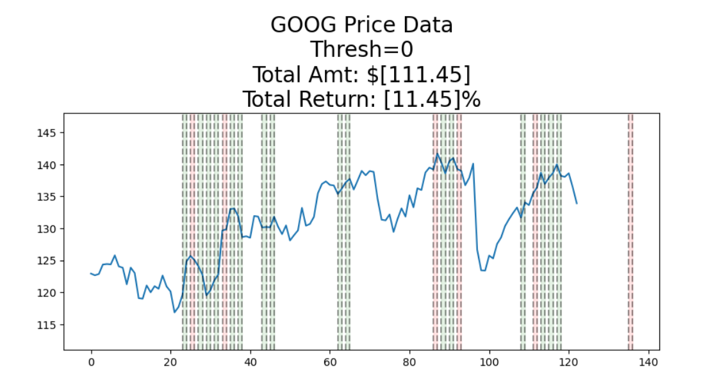
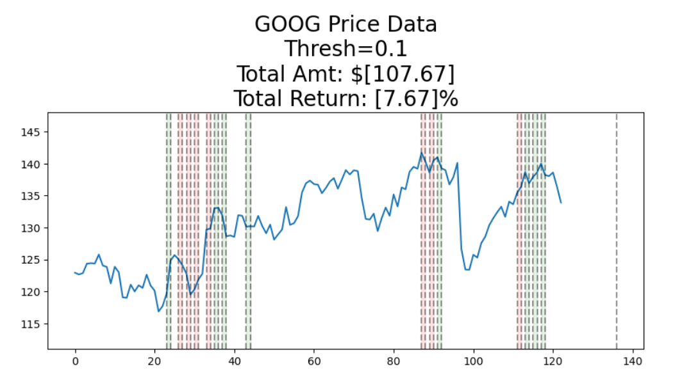

# Stock Prediction and Trading Strategy

## Overview

This repository contains the code and documentation for a stock prediction and trading strategy project. The project aims to predict stock prices using an LSTM model and implement a trading strategy based on the model's predictions.

## Table of Contents

- [Installation](#installation)
- [Usage](#usage)
- [Project Structure](#project-structure)
- [Dependencies](#dependencies)
- [Data](#data)
- [Results](#results)
- [How to Contribute](#how-to-contribute)

## Installation

1. Clone the repository:

`git clone https://github.com/your-username/stock-prediction-trading.git`

2. Install the required dependencies:

`pip install -r requirements.txt`

## Usage

- Open the Jupyter Notebook file Stock_Prediction_Trading.ipynb in a Jupyter environment.
- Run the cells to execute the code and generate predictions.
- Explore the simulation results and visualize trading performance.

## Project Structure

- Jupyter Notebook containing the code for stock prediction and trading simulation.
- Requirements file

## Dependencies

- Python
- Jupyter Notebook
- pandas
- yfinance
- matplotlib
- seaborn
- statsmodels
- tensorflow
- keras
- sklearn
- tqdm

# Install the dependencies using the provided requirements.txt file:

`pip install -r requirements.txt`

## Data

The historical stock price data for Google (GOOG) is downloaded using the yfinance library.

## Results

### Simulation Results:
1. **Threshold = 0:**
   - Initial Amount: $100
   - Positive Return: 11.45%
   - Total Return Amount: $111.45

  

2. **Threshold = 0.1:**
   - Initial Amount: $100
   - Positive Return: 7.67%
   - Total Return Amount: $107.67
  
  

## How to Contribute

- If you'd like to contribute to this project, please follow these steps:
- Fork the repository.
- Create a new branch for your feature: `git checkout -b feature-name`
- Commit your changes: `git commit -m 'Add new feature'`
- Push to the branch: `git push origin feature-name`
- Submit a pull request.
